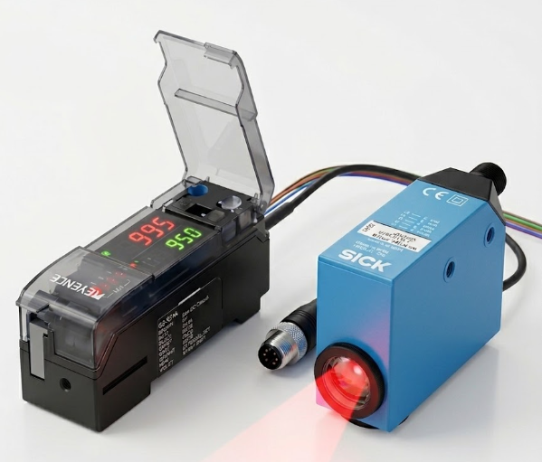
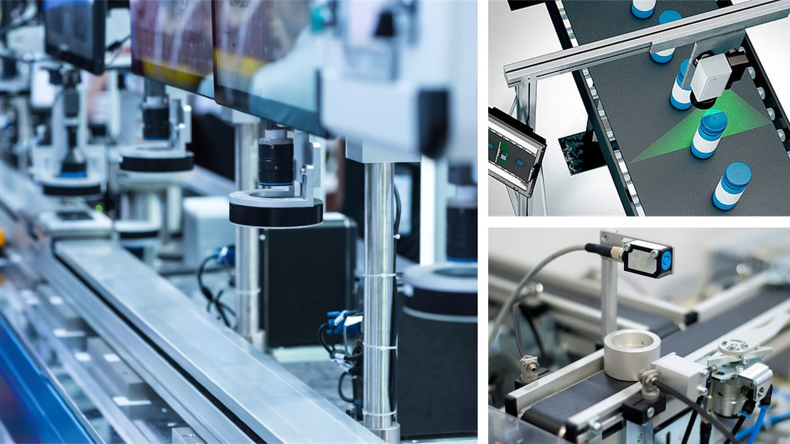
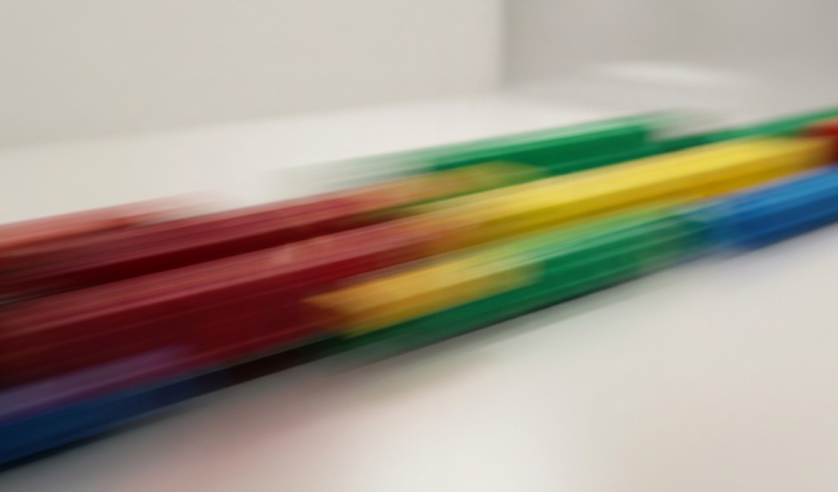
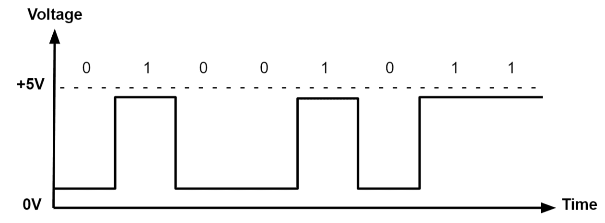

Ứng dụng cảm biến màu để phân loại phôi di chuyển tốc độ cao (Applying Color Sensors to Classify High-Speed Moving Workpieces)

**Dự án Nghiên cứu Khoa học Sinh viên (NCKH) 2025 - 2026**
**Student Scientific Research Project 2025 - 2026**

## Thông tin chung / General Information

- **Tên đề tài / Project Title:** Ứng dụng cảm biến màu để phân loại phôi di chuyển tốc độ cao (Applying Color Sensors to Classify High-Speed Moving Workpieces)
- **Chủ nhiệm đề tài / Principal Investigator:** Hoàng Trung An
- **Khoa / Faculty:** Khoa Cơ khí – Cơ điện tử (Faculty of Mechanical - Mechatronics Engineering)

## Mục tiêu đề tài / Project Objectives

**Tiếng Việt:**
Nghiên cứu ứng dụng cảm biến màu công nghiệp để làm nền tảng cho hệ thống phân loại tốc độ cao, làm tiền đề cho giải pháp loại bỏ sản phẩm lỗi trên băng tải không ngừng.

**English:**
Researching the application of industrial color sensors as a foundation for high-speed sorting systems, serving as a premise for continuous on-conveyor defect product elimination solutions.

---

## Cấu trúc thư mục / Project Structure

Dự án đã được tổ chức lại để dễ dàng theo dõi và quản lý mã nguồn, dữ liệu cũng như tài liệu liên quan.
The project has been reorganized to easily track and manage source code, data, and related documents.

| Thư mục / Folder               | Mô tả / Description                                                         |
| :------------------------------- | :---------------------------------------------------------------------------- |
| `01_Data_Sample`               | Mẫu dữ liệu thực nghiệm / Experimental Data Samples                      |
| `02_MATLAB_Source_Code`        | Mã nguồn MATLAB xử lý / MATLAB Processing Source Code                     |
| `03_STM32_and_App_Code`        | Mã nguồn điều khiển STM32 và App / STM32 Firmware & App Code            |
| `04_Presentations_and_Reports` | Báo cáo tổng kết và Slide thuyết trình / Final Reports & Presentations |
| `05_Demo_Videos`               | Video mô phỏng và chạy thực tế / System Demonstration Videos            |
| `06_Posters`                   | Poster trình bày / Project Posters                                          |
| `07_Datasheets`                | Tài liệu kỹ thuật các cảm biến (Keyence, SICK) / Component Datasheets  |
| `08_Images_for_README`         | Ảnh trích xuất từ báo cáo / Extracted Media for Documentation           |

---

## Hình ảnh minh họa / Project Gallery

*(Dưới đây là các hình ảnh/slide mô tả thiết kế và hệ thống trích xuất từ quá trình nghiên cứu / Below are design and system images extracted from the research process)*

*(Xem thêm tại thư mục `08_Images_for_README` / See more in `08_Images_for_README` directory)*

---

## Hướng dẫn sử dụng / How to Use

1. **Mã nguồn Vi điều khiển (STM32)**: Xem trong thư mục `03_STM32_and_App_Code` để biết cách cấu hình giao tiếp vi điều khiển với cảm biến màu.
2. **Xử lý dữ liệu**: Sử dụng các script trong thư mục `02_MATLAB_Source_Code` để phân tích dữ liệu tại `01_Data_Sample`.
3. **Demo**: Xem thư mục `05_Demo_Videos` để thấy hệ thống hoạt động thực tế với đĩa quay tốc độ cao (Spinning Disc Demo).
4. **Tài liệu tham khảo**: Tra cứu thêm thông tin kỹ thuật của cảm biến ở thư mục `07_Datasheets`.
